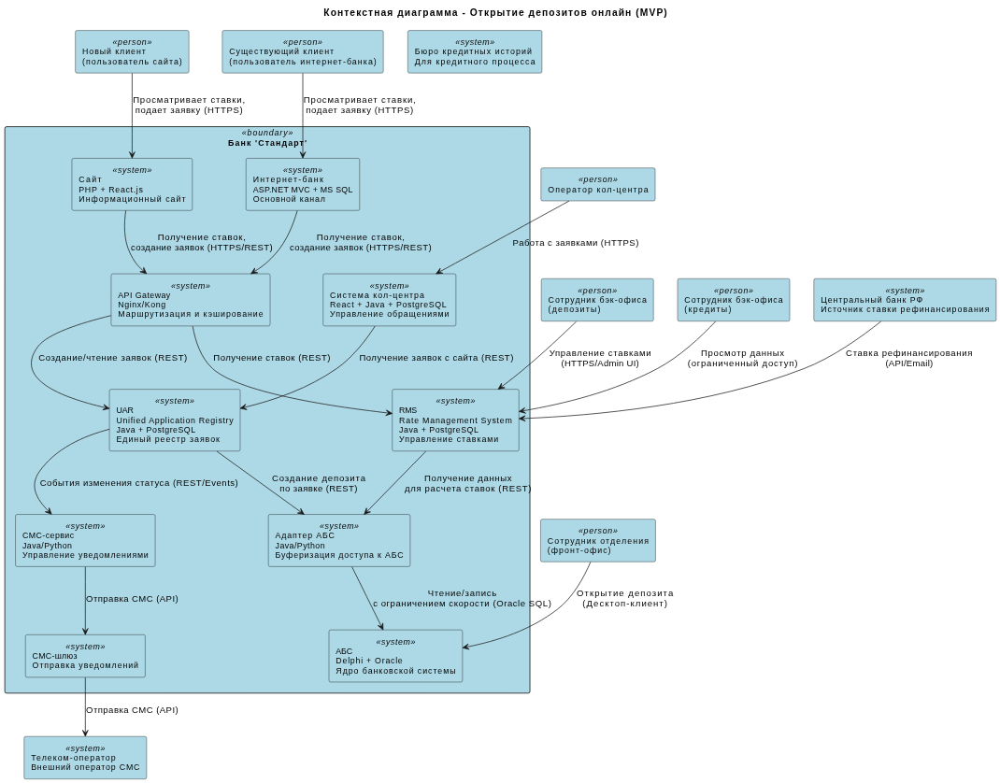
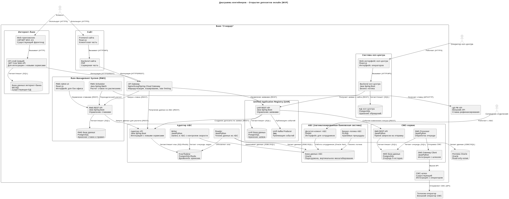

### **Название задачи: Архитектура MVP для онлайн-открытия депозитов (сайт и интернет-банк)** 
### **Автор: Архитектор команды цифровой трансформации**
### **Дата: 03.03.2026**
### **Функциональные требования**
Опишите здесь верхнеуровневые Use Cases. Их нужно оформить в виде таблицы с пошаговым описанием:

|**№**|**Действующие лица или системы**|**Use Case**|**Описание**|
| :-: | :- | :- | :- |
|UC1|Новый клиент, Сайт, Кол-центр, АБС|Подача заявки на депозит через сайт|1. Клиент заходит на сайт и просматривает список депозитов с актуальными ставками. 2. Клиент заполняет форму с ФИО и номером телефона. 3. Система сохраняет заявку и передает ее в систему кол-центра. 4. Менеджер кол-центра видит заявку и связывается с клиентом. 5. При необходимости менеджер предлагает особые условия. 6. Клиент приходит в отделение для идентификации и подписания документов. 7. Сотрудник отделения открывает депозит в АБС.|
|UC2|Существующий клиент, Интернет-банк, АБС, СМС-шлюз|Подача заявки на депозит через интернет-банк|1. Клиент входит в интернет-банк и видит список депозитов с персонализированными ставками. 2. Клиент выбирает депозит, указывает счет и сумму. 3. Система отправляет СМС с кодом подтверждения. 4. Клиент вводит код, заявка отправляется в бэк-офис. 5. Сотрудник бэк-офиса обрабатывает заявку и подтверждает условия в АБС. 6. Клиент получает СМС о подтверждении ставки. 7. Сотрудник бэк-офиса открывает депозит в АБС. 8. Клиент получает СМС об открытии депозита.|
|UC3|Сотрудник бэк-офиса (депозиты), Система управления ставками, АБС|Управление ставками по депозитам|1. Сотрудник бэк-офиса депозитов получает данные о ставке рефинансирования от ЦБ (автоматически через API или в ручном режиме). 2. Сотрудники депозитного и кредитного подразделений вносят данные в систему управления ставками (Rate Management System). 3. Система автоматически рассчитывает актуальные ставки по депозитам. 4. Ставки публикуются на сайте и в интернет-банке. 5. Для отдельных клиентов сотрудник может установить персонализированные ставки.|
|UC4|Сотрудник кол-центра, Система кол-центра, АБС|Обработка заявки с сайта|1. Сотрудник кол-центра видит новую заявку в системе кол-центра. 2. Открывает карточку клиента, проверяет переданные данные. 3. При необходимости запрашивает дополнительные данные у клиента по телефону. 4. Может инициировать запрос на особые условия через систему управления ставками. 5. После разговора обновляет статус заявки. 6. Заявка остается доступной для сотрудника отделения при визите клиента.|
|UC5|Сотрудник отделения, АБС, Система управления ставками|Открытие депозита в отделении (по заявке или новое)|1. Сотрудник отделения идентифицирует клиента. 2. Проверяет наличие предварительной заявки (с сайта или интернет-банка). 3. Если заявка есть, открывает ее, видит согласованные условия. 4. Если заявки нет, создает новую заявку, используя актуальные ставки из системы управления ставками. 5. Открывает депозит в АБС. 6. Печатает документы, клиент подписывает. 7. Сотрудник загружает скан-копии документов в АБС.|
### **Нефункциональные требования**
Опишите здесь нефункциональные требования и архитектурно значимые требования.

|**№**|**Требование**|
| :-: | :- |
|NFR1|Минимизировать прямое обращение интернет-банка и сайта к АБС из-за перегруженности БД Oracle.|
|NFR2|Обеспечить доступность новых сервисов на уровне 99.9% с возможностью переключения на резервный ЦОД.|
|NFR3|Время отклика при работе с интернет-банком должно составлять миллисекунды (особенно при загрузке ставок).|
|NFR4|Все чувствительные данные клиентов должны передаваться с шифрованием (HTTPS).|
|NFR5|СМС-функционал должен реализовываться силами команды банка, без доработок ядра системы подрядчиком.|
|NFR6|Новые компоненты должны использовать технологии, совместимые с существующим стеком (Java, Python, React, MS SQL, Oracle) и учитывать текущие компетенции команд.|
|NFR7|Для асинхронного взаимодействия предпочтительно использовать Kafka, но с учетом несовместимости с текущей версией интернет-банка.|
|NFR8|Система должна поддерживать горизонтальное масштабирование для новых компонентов.|
|NFR9|Обеспечить сквозной процесс обработки заявок между каналами (сайт -> кол-центр -> отделение -> бэк-офис).|
|NFR10|Сотрудники депозитного и кредитного подразделений не должны иметь прямого доступа к данным друг друга.|
|NFR11|Разработать документацию для дальнейшего расширения системы.|
### **Решение**
Приведите диаграммы контекста и контейнеров в модели C4. Опишите там основные компоненты и интеграции всех элементов решения. 

[Ссылка на исходный код UML](context-diagram-deposit.puml)

Система открытия депозитов онлайн взаимодействует со следующими внешними системами и пользователями:
- Клиенты (новые и существующие) - взаимодействуют через Сайт и Интернет-банк.
- Сотрудники кол-центра - работают с заявками через Систему кол-центра.
- Сотрудники отделений (фронт-офис) - работают через АБС.
- Сотрудники бэк-офиса (депозиты) - управляют ставками через новую Систему управления ставками.
- Сотрудники бэк-офиса (кредиты) - только просматривают данные для расчета ставок.
- Центральный банк РФ - источник ставки рефинансирования (API/email).
- Телеком-оператор - отправка СМС через СМС-шлюз.

[Ссылка на исходный код UML](containers-diagram-deposit.puml)

1. Интернет-банк (существующий, требует доработки):
    - Web-приложение - ASP.NET MVC 4.5, фронтенд
    - API-слой (новый) - предлагается добавить слой API на .NET Core для новых функций, чтобы не ломать существующий монолит и обеспечить совместимость с Kafka в будущем
    - База данных - MS SQL (существующая)

2. Сайт (существующий, требует доработки):
    - Web-приложение - PHP + React.js
    - API-клиент - для взаимодействия с новыми сервисами

3. Новая система управления ставками (Rate Management System - RMS):
    - Backend - Java Spring Boot (экспертиза есть у команды АБС и подрядчика кол-центра)
    - База данных - PostgreSQL (уже используется в системе кол-центра, есть экспертиза)
    - API (REST) - для интеграции с сайтом, интернет-банком, АБС и системой кол-центра
    - Admin UI - React.js (для сотрудников бэк-офиса)

4. Единый реестр заявок (Unified Application Registry - UAR):
    - Backend - Java Spring Boot
    - База данных - PostgreSQL
    - API - для создания и отслеживания заявок из всех каналов
    - Kafka Producer/Consumer - для асинхронного обмена (готовность к будущему)

5. API Gateway (новый компонент):
    - Технология - Nginx/Kong/Spring Cloud Gateway
    - Функции - маршрутизация, кэширование (ставок, справочников), аутентификация, rate limiting

6. Адаптер для АБС (новый компонент, критически важный):
    - Backend - Java (Python как альтернатива)
    - Функции - буферизация запросов к АБС, пакетная обработка, кэширование данных из АБС
    - Синхронизация - чтение данных из АБС (реплика или batch-выгрузка), запись в АБС через очередь с контролируемой скоростью

7. АБС (существующая, без изменений в ядре):
    - Десктоп-клиент - Delphi
    - База данных - Oracle (перегружена)

8. Система кол-центра (существующая, требует доработки):
    - Frontend - React.js
    - Backend - Java Spring Boot
    - База данных - PostgreSQL
    - Интеграция - будет получать заявки из UAR через API

9. СМС-сервис (новый компонент или доработка существующего):
    - Backend - Python/Java
    - Интеграция - с UAR (события изменения статуса заявки) и СМС-шлюзом

#### Обоснование решений:
1. Введение API Gateway:
    - Снижает нагрузку на АБС за счет кэширования ставок и справочных данных
    - Обеспечивает единую точку входа для всех каналов
    - Позволяет реализовать rate limiting для защиты нижележащих систем

2. Создание адаптера для АБС:
    - Критически важное решение из-за перегруженности АБС
    - Позволяет контролировать нагрузку на Oracle БД
    - Использует паттерн "буфер/очередь" для записи, реплику для чтения

3. Выделение RMS (Rate Management System):
    - Замена Excel-процессов на автоматизированную систему
    - Решает проблему отсутствия единого источника ставок
    - Учитывает ограничение NFR10 (разделение доступа депозитного и кредитного подразделений)
    - Технологии Java/PostgreSQL - есть экспертиза в банке

4. Создание UAR (Unified Application Registry):
    - Обеспечивает сквозной процесс (UC4, UC5) - заявка видна во всех каналах
    - Снимает нагрузку с АБС по хранению временных данных
    - Готов к использованию Kafka (NFR7) через абстракцию событий

5. Стратегия работы с СМС:
    - Выделенный СМС-сервис, а не доработка ядра (NFR5)
    - Интеграция через события UAR, а не прямой вызов из каждого канала

6. Асинхронность где возможно:
    - UAR как источник событий
    - Подготовка к Kafka, но на первом этапе можно использовать REST + очереди в БД
    - Для АБС - только асинхронная запись

### **Альтернативы**
1. Прямая интеграция интернет-банка с АБС:
    - Отвергнуто из-за перегруженности АБС (NFR1)
    - Риск недоступности банка в целом при росте нагрузки

2. Расширение функционала АБС для управления ставками:
    - Отвергнуто из-за перегруженности БД Oracle
    - Сложность доработки Delphi-клиента
    - Невозможность горизонтального масштабирования

3. Единый монолит для новых функций:
    - Отвергнуто в пользу микросервисной архитектуры для возможности масштабирования отдельных компонентов

4. RabbitMQ вместо Kafka:
    - Рассматривается как промежуточное решение, но Kafka выбрана на перспективу

**Недостатки, ограничения, риски**
1. Риск нагрузки на АБС:
    - Даже с адаптером и кэшированием, некоторые операции потребуют обращения к АБС
    - Митигация: тщательное профилирование, мониторинг, увеличение интервалов синхронизации при росте нагрузки

2. Сложность интеграции с интернет-банком на ASP.NET:
    - Несовместимость с Kafka (NFR7)
    - Митигация: добавление API-слоя на .NET Core, использование REST для синхронных вызовов

3. Увеличение количества новых компонентов:
    - RMS, UAR, API Gateway, Адаптер АБС, СМС-сервис - 5 новых систем
    - Митигация: итеративный подход, MVP только с критичными компонентами

4. Требование 99.9% доступности (NFR2):
    - Текущая инфраструктура с одним ЦОД для интернет-банка не соответствует
    - Митигация: развертывание новых компонентов в обоих ЦОД с балансировкой, план миграции интернет-банка

5. Риск согласованности данных:
    - Асинхронная запись в АБС может привести к временной несогласованности
    - Митигация: статусная модель в UAR, компенсирующие транзакции, бизнес-процессы сверки

6. Безопасность и разделение доступа (NFR10):
    - Требует тонкой настройки прав в RMS
    - Митигация: ролевая модель, аудит доступа

7. Необходимость обучения команд:
    - Новые технологии (Kafka в перспективе) требуют обучения
    - Митигация: использование знакомых стеков (Java, Spring, PostgreSQL) на первом этапе

8. Юридические ограничения (очная идентификация):
    - Нельзя полностью автоматизировать открытие для новых клиентов
    - Митигация: гибридный процесс (онлайн-заявка + офлайн-идентификация)