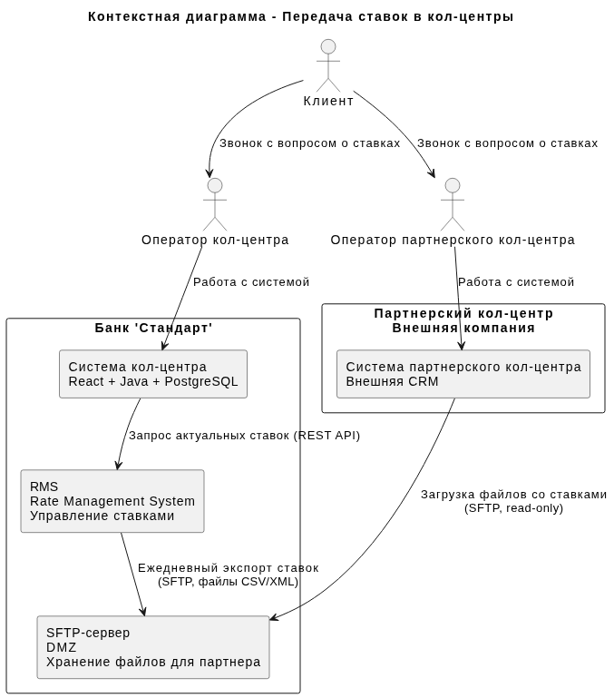
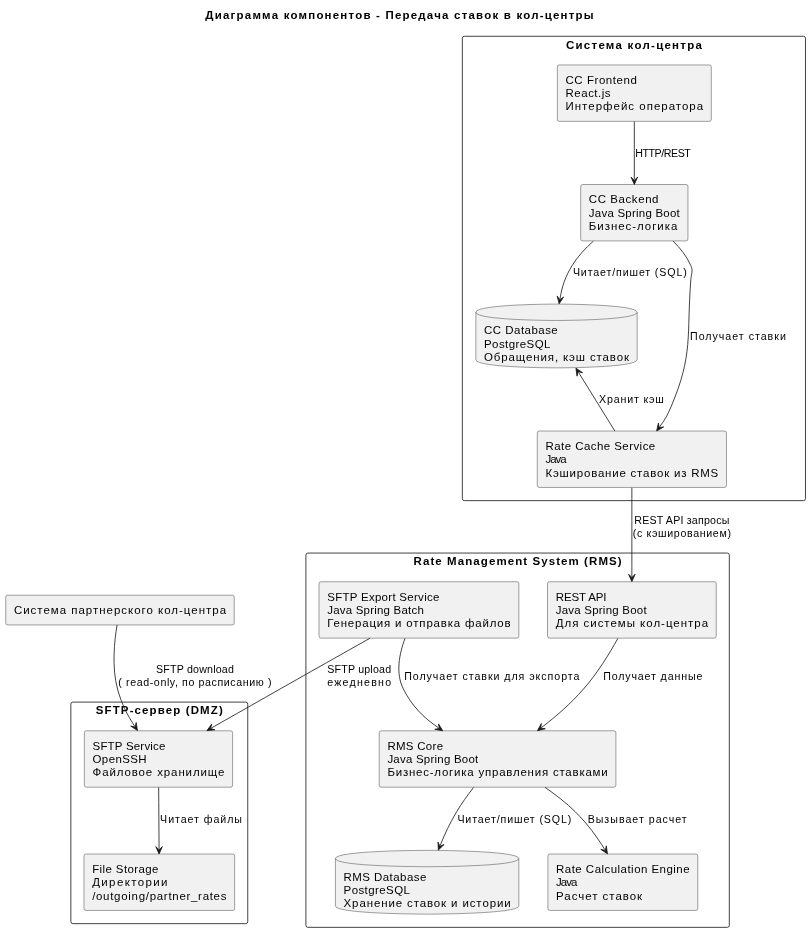
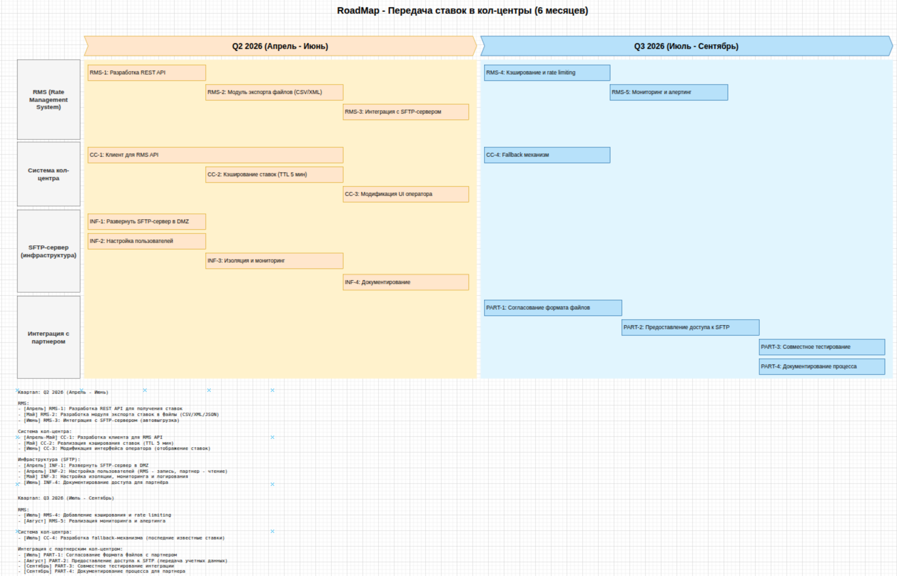

### **Название задачи: Интеграция системы управления ставками с кол-центрами (собственным и партнерским)** 
### **Автор: Архитектор команды цифровой трансформации**
### **Дата: 04.03.2026**
### **Функциональные требования**
Опишите здесь верхнеуровневые Use Cases. Их нужно оформить в виде таблицы с пошаговым описанием:

|**№**|**Действующие лица или системы**|**Use Case**|**Описание**|
| :-: | :- | :- | :- |
|UC1|Оператор собственного кол-центра, Система кол-центра, RMS|Консультация клиента по ставкам депозитов|1. Клиент звонит в кол-центр с вопросом о ставках по депозитам. 2. Оператор открывает интерфейс системы кол-центра. 3. Система отображает актуальные ставки по депозитам, полученные из RMS. 4. Оператор консультирует клиента на основе актуальных данных.|
|UC2|Оператор партнерского кол-центра, Внешняя система партнера, SFTP-сервер|Консультация клиента партнерским кол-центром|1. Клиент звонит в партнерский кол-центр. 2. Оператор открывает свою систему. 3. Система партнера загружает актуальные ставки с SFTP-сервера банка. 4. Оператор видит ставки и консультирует клиента.|
|UC3|RMS, SFTP-сервер|Экспорт ставок для партнерского кол-центра|1. RMS ежедневно формирует файл с актуальными ставками по депозитам. 2. RMS передает файл на SFTP-сервер банка. 3. SFTP-сервер доступен для чтения партнерскому кол-центру.|
|UC4|RMS, Система кол-центра|Предоставление ставок для собственного кол-центра|1. RMS предоставляет REST API для получения актуальных ставок. 2. Система кол-центра вызывает API при загрузке интерфейса оператора или по расписанию. 3. Система кол-центра кэширует ставки для снижения нагрузки.|

### **Нефункциональные требования**
Опишите здесь нефункциональные требования и архитектурно значимые требования.

|**№**|**Требование**|
| :-: | :- |
|NFR1|Ставки должны быть доступны операторам кол-центра с задержкой не более 1 минуты после обновления в RMS|
|NFR2|Партнерский кол-центр должен получать актуальные ставки ежедневно (не реже 1 раза в сутки)|
|NFR3|Файлы для партнерского кол-центра должны передаваться по SFTP|
|NFR4|Доступ к SFTP-серверу должен быть защищен (авторизация по ключам/паролям, изоляция в DMZ)|
|NFR5|RMS API для системы кол-центра должен выдерживать пиковую нагрузку (до 1000 запросов в минуту)|
|NFR6|Система кол-центра должна кэшировать ставки для снижения нагрузки на RMS (время жизни кэша - 5 минут)|
|NFR7|Формат файлов для партнера должен быть согласован и документирован (CSV/XML/JSON)|
|NFR8|Необходимо логирование всех операций доступа к ставкам для аудита|

### **Решение**
Приведите диаграммы контекста и контейнеров в модели C4. Опишите там основные компоненты и интеграции всех элементов решения. 

#### Контекстная диаграмма (C4 - Context)

[Ссылка на исходный код UML](context-diagram-deposit.puml)

#### Диаграмма компонентов (C4 - Components)

[Ссылка на исходный код UML](containers-diagram-deposit.puml)

#### Логика принятия решений:
1. Два разных подхода для двух кол-центров:
    - Собственный кол-центр получает данные через API (REST) - это быстрее, позволяет обновлять ставки в реальном времени
    - Партнерский кол-центр получает файлы через SFTP - так как у партнера нет API, только файловый обмен (текущий обмен скриптами)

2. Кэширование в системе кол-центра:
    - Снижает нагрузку на RMS (NFR6)
    - Обеспечивает быстрый доступ для операторов
    - TTL кэша 5 минут - компромисс между актуальностью и нагрузкой

3. Выделенный SFTP-сервер в DMZ:
    - Безопасность - изоляция от внутренних систем (NFR4)
    - Партнер имеет доступ только к своей директории, read-only
    - Журналирование всех операций (NFR8)

4. Формат файлов:
    - CSV/XML/JSON - стандартные форматы, легко читаемые любой CRM
    - Включают дату/время актуальности ставок
    - Содержат все продукты с текущими и будущими ставками

5. Периодичность обновления:
    - Для собственного кол-центра - реальное время (NFR1)
    - Для партнера - ежедневно (NFR2), так как ставки меняются не чаще раза в день (предположение)

### **Альтернативы**
1. Единый API для обоих кол-центров:
    - Отвергнуто, так как партнер не поддерживает API-интеграцию (в настоящий момент)
    - Потребовало бы доработки системы партнера, что невозможно

2. Передача ставок через email:
    - Рассматривалось, но отвергнуто из-за ненадежности и отсутствия автоматизации
    - Email не гарантирует доставку, сложно автоматизировать загрузку в CRM партнера

3. Ручное обновление ставок операторами:
    - Текущий процесс, который ведет к ошибкам и задержкам
    - Отвергнут из-за высокого риска при росте нагрузки

4. Прямая интеграция RMS с системой партнера через VPN:
    - Технически возможно, но требует сложной настройки и согласования
    - Отвергнуто из-за сроков и бюрократических барьеров

**Недостатки, ограничения, риски**
1. Задержка обновления для партнерского кол-центра:
    - Ставки обновляются раз в сутки, клиент может получить устаревшую информацию
    - Митигация: указывать в файле дату актуальности, оператор предупреждает клиента о возможных изменениях

2. Безопасность SFTP-сервера:
    - Открытый доступ из внешней сети - потенциальная точка атаки
    - Митигация: строгая изоляция в DMZ, мониторинг попыток доступа, белые списки IP партнера

3. Согласованность данных между каналами:
    - Возможны расхождения между API (реалтайм) и файлами (раз в сутки)
    - Митигация: синхронизация времени экспорта, версионность файлов

4. Нагрузка на RMS от системы кол-центра:
    - При пиковых нагрузках может не справиться
    - Митигация: кэширование, rate limiting, мониторинг

5. Поддержка форматов файлов:
    - Партнер может изменить требования к формату
    - Митигация: документированный API файлового обмена, версионирование форматов

6. Отказоустойчивость:
    - При недоступности RMS операторы не увидят ставки
    - Митигация: кэш в системе кол-центра, fallback на последние известные ставки с пометкой

### Список крупных задач для каждой системы
#### Для RMS (Rate Management System):
|**ID**|**Задача**|**Описание**|**Приоритет**|
| :-: | :- | :- | :- |
|RMS-1|Разработать REST API для получения ставок|Создать эндпоинты для системы кол-центра с поддержкой фильтрации|Высокий|
|RMS-2|Разработать модуль экспорта ставок в файлы|Создать генератор файлов в форматах CSV/XML/JSON|Высокий|
|RMS-3|Реализовать интеграцию с SFTP-сервером|Настроить автоматическую выгрузку файлов на SFTP|Высокий|
|RMS-4|Добавить кэширование и rate limiting|Оптимизировать API для высоких нагрузок|Средний|
|RMS-5|Реализовать мониторинг и алертинг|Отслеживать успешность экспорта и нагрузку на API|Средний|

#### Для системы кол-центра:
|**ID**|**Задача**|**Описание**|**Приоритет**|
| :-: | :- | :- | :- |
|CC-1|Разработать клиент для RMS API|Создать модуль для вызова RMS API из бэкенда|Высокий|
|CC-2|Реализовать кэширование ставок|Добавить кэш с TTL 5 минут в БД системы|Высокий|
|CC-3|Модифицировать интерфейс оператора|Добавить отображение ставок в UI оператора|Высокий|
|CC-4|Разработать fallback-механизм|Отображать последние известные ставки при недоступности RMS|Средний|

#### Для инфраструктуры (SFTP-сервер):
|**ID**|**Задача**|**Описание**|**Приоритет**|
| :-: | :- | :- | :- |
|INF-1|Развернуть SFTP-сервер в DMZ|Установка и конфигурация OpenSSH сервера|Высокий|
|INF-2|Настроить пользователей и права|Создать учетные записи для RMS (запись) и партнера (чтение)|Высокий|
|INF-3|Настроить изоляцию и мониторинг|Ограничить доступ, настроить логирование|Высокий|
|INF-4|Документировать доступ для партнера|Подготовить инструкцию для партнерского кол-центра|Средний|

#### Для интеграции с партнерским кол-центром:
|**ID**|**Задача**|**Описание**|**Приоритет**|
| :-: | :- | :- | :- |
|PART-1|Согласовать формат файлов|Определить структуру файлов с партнером|Высокий|
|PART-2|Предоставить доступ к SFTP|Передать учетные данные, настроить IP-фильтры|Высокий|
|PART-3|Провести тестирование|Совместное тестирование загрузки и чтения файлов|Высокий|
|PART-4|Документировать процесс|Описать процесс обновления ставок для партнера|Средний|

#### RoadMap в draw.io

[Ссылка на исходный код drawio](RoadMap_bank_Standart.drawio)

#### Целевое решение на горизонте года:
1. Переход на реальное время для партнерского кол-центра (API, если партнер модернизирует систему)
2. Внедрение аналитики использования ставок (какие продукты чаще всего запрашивают)
3. Персонализация ставок для операторов (видят ставки с учетом истории клиента)
4. Интеграция с голосовым меню IVR (автоматическое озвучивание ставок)