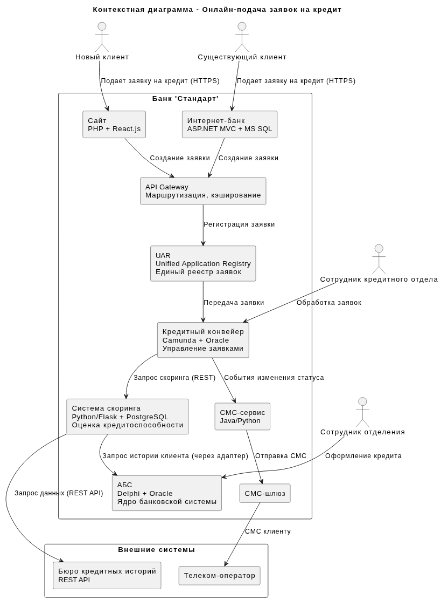
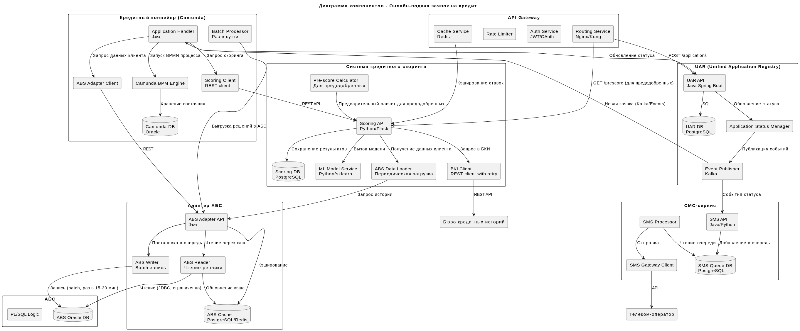

### **Название задачи: Архитектура онлайн-подачи заявок на кредит (сайт и интернет-банк)** 
### **Автор: Архитектор команды цифровой трансформации**
### **Дата: 04.03.2026**
### **Функциональные требования**
Опишите здесь верхнеуровневые Use Cases. Их нужно оформить в виде таблицы с пошаговым описанием:

|**№**|**Действующие лица или системы**|**Use Case**|**Описание**|
| :-: | :- | :- | :- |
|UC1|Новый клиент, Сайт, Кредитный конвейер, Система скоринга, БКИ|Подача заявки на кредит через сайт (с паспортными данными)|1. Новый клиент заходит на сайт, видит предложения по кредитам. 2. Заполняет форму: ФИО, телефон, паспортные данные. 3. Система передает данные в Кредитный конвейер. 4. Кредитный конвейер вызывает Систему скоринга. 5. Система скоринга запрашивает данные из БКИ (API) и АБС (история, если есть). 6. Клиенту отображается решение (одобрено/отказано) в реальном времени. 7. При одобрении клиент получает СМС с информацией о необходимости посетить отделение.|
|UC2|Новый клиент, Сайт, Кредитный конвейер|Подача заявки на кредит через сайт (минимальные данные)|1. Новый клиент заполняет только ФИО и телефон. 2. Заявка сохраняется в Кредитном конвейере. 3. Сотрудник кол-центра связывается с клиентом для сбора дополнительных данных. 4. После сбора данных запускается скоринг. 5. Клиент информируется о результате по телефону/СМС.|
|UC3|Существующий клиент, Интернет-банк, Кредитный конвейер, Система скоринга|Просмотр предодобренного предложения|1. Клиент входит в интернет-банк. 2. Система отображает предодобренное предложение по кредиту (на основе ранее рассчитанного скоринга). 3. Клиент видит сумму и ставку.|
|UC4|Существующий клиент, Интернет-банк, Кредитный конвейер, Система скоринга, СМС-сервис|Подача заявки на кредит по предодобренному предложению|1. Клиент выбирает предодобренное предложение. 2. Подтверждает операцию СМС-кодом. 3. Система запускает упрощенный скоринг (проверка актуальности данных). 4. Заявка отправляется в Кредитный конвейер с пометкой "предодобренная". 5. Сотрудник кредитного отдела обрабатывает заявку в течение дня. 6. Клиент получает СМС о статусе заявки.|
|UC5|Сотрудник кредитного отдела, Кредитный конвейер, Система скоринга, АБС|Обработка заявки на кредит|1. Сотрудник видит новые заявки в Кредитном конвейере. 2. Для предодобренных заявок проверяет минимальные данные и подтверждает. 3. Для обычных заявок запускает полный скоринг (если не был запущен автоматически). 4. Принимает решение. 5. Информация о решении передается в АБС (batch) и клиенту (СМС).|
|UC6|Сотрудник отделения, АБС, Кредитный конвейер|Оформление кредита в отделении по онлайн-заявке|1. Клиент приходит в отделение с паспортом. 2. Сотрудник находит заявку по номеру/паспорту в АБС (интеграция с Кредитным конвейером). 3. Открывает кредит в АБС на утвержденных условиях. 4. Печатает документы, клиент подписывает. 5. Средства зачисляются на счет клиента.|

### **Нефункциональные требования**
Опишите здесь нефункциональные требования и архитектурно значимые требования.

|**№**|**Требование**|
| :-: | :- |
|NFR1|Время ответа скоринга для клиента с паспортными данными - не более 5 секунд (с учетом запросов в БКИ).|
|NFR2|Заявки по предодобренным предложениям должны обрабатываться сотрудниками в течение рабочего дня.|
|NFR3|Необходимо исключить прямые запросы к АБС из онлайн-каналов (из-за перегруженности Oracle).|
|NFR4|Кредитный конвейер и Система скоринга должны поддерживать горизонтальное масштабирование.|
|NFR5|Нагрузка на Систему скоринга в рабочие часы должна быть оптимизирована (избегать предрасчетов без необходимости).|
|NFR6|Данные клиентов при передаче должны шифроваться (HTTPS).|
|NFR7|СМС-уведомления об изменении статуса заявки должны доставляться в реальном времени.|
|NFR8|Предодобренные предложения должны рассчитываться на основе актуальных данных не старше 24 часов.|
|NFR9|Система должна поддерживать 99.9% доступность в рабочее время.|
|NFR10|Необходимо обеспечить сквозной процесс между каналами (сайт → интернет-банк → отделение).|
|NFR11|Интеграция с БКИ должна быть отказоустойчивой (retry, timeout, fallback).|

### **Решение**
Приведите диаграммы контекста и контейнеров в модели C4. Опишите там основные компоненты и интеграции всех элементов решения. 

#### Контекстная диаграмма (C4 - Context)

[Ссылка на исходный код UML](context-diagram-deposit.puml)

#### Диаграмма компонентов (C4 - Components)

[Ссылка на исходный код UML](components-diagram-deposit.puml)

#### Логика принятия решений:
1. Использование UAR (Unified Application Registry):
    - Единый реестр заявок для всех каналов (сайт, интернет-банк, отделение)
    - Сквозной процесс (NFR10)
    - Событийная модель для уведомлений

2. Интеграция с Кредитным конвейером через UAR:
    - UAR принимает заявки из онлайн-каналов и передает в Camunda
    - Не меняем ядро Кредитного конвейера, используем его API

3. Два режима скоринга:
    - Полный скоринг (для новых клиентов с паспортными данными) - онлайн, с вызовом БКИ
    - Упрощенный скоринг (для предодобренных) - проверка актуальности данных
    - Соответствует NFR5 (не нагружать скоринг лишними расчетами)

4. Предодобренные предложения:
    - Рассчитываются на основе данных не старше 24 часов (NFR8)
    - Хранятся в UAR или Кредитном конвейере
    - Отображаются в интернет-банке при входе клиента

5. Адаптер АБС:
    - Защита перегруженной БД Oracle (NFR3)
    - Кэширование данных клиентов для скоринга
    - Batch-запись решений по кредитам

6. СМС-уведомления через событийную модель:
    - UAR публикует события изменения статуса
    - СМС-сервис подписывается на события
    - Обеспечивает real-time уведомления (NFR7)

7. Интеграция с БКИ:
    - Retry-механизм с экспоненциальной задержкой
    - Таймауты (3 секунды) для соблюдения NFR1
    - Кэширование ответов на короткое время для повторных запросов

8. Обработка в рабочий день (NFR2):
    - Предодобренные заявки получают высокий приоритет в Camunda
    - Назначение ответственных сотрудников в рабочие часы

### **Альтернативы**
1. Прямая интеграция интернет-банка с Кредитным конвейером:
    - Отвергнуто из-за необходимости сквозного процесса (NFR10)
    - UAR обеспечивает единый реестр и историю по всем каналам

2. Реализация скоринга в Кредитном конвейере, а не в отдельной системе:
    - Отвергнуто, так как Система скоринга уже существует и написана на Python с ML-моделями
    - Переписывание заняло бы много времени

3. Синхронная запись в АБС при одобрении кредита:
    - Отвергнуто из-за перегруженности АБС (NFR3)
    - Выбрана асинхронная запись через адаптер

4. Единый скоринг для всех типов заявок:
    - Отвергнуто из-за требования оптимизации нагрузки (NFR5)
    - Разделение на полный и упрощенный скоринг

5. Хранение предодобренных предложений в интернет-банке:
    - Отвергнуто, так как логика расчета должна быть в Кредитном конвейере
    - Выбрано хранение в UAR/Кредитном конвейере с кэшированием в API Gateway

**Недостатки, ограничения, риски**
1. Задержки при интеграции с БКИ:
    - Внешний API может быть медленным или недоступным
    - Митигация: таймауты, кэширование, fallback-режим с отложенным скорингом

2. Нагрузка на Систему скоринга:
    - Рост числа онлайн-заявок может превысить текущие мощности
    - Митигация: горизонтальное масштабирование (Python/Flask), кэширование результатов

3. Сложность сквозного процесса:
    - Заявка проходит через 4+ систем (сайт → UAR → Конвейер → Скоринг → АБС)
    - Риск потери или дублирования заявок
    - Митигация: идемпотентность, статусная модель, компенсационные транзакции

4. Актуальность данных для предодобренных предложений:
    - За 24 часа данные клиента могли измениться
    - Митигация: повторный скоринг при подаче заявки (упрощенный)

5. Batch-запись в АБС:
    - Задержка между одобрением кредита и появлением данных в АБС (до 30 мин)
    - Риск: клиент приходит в отделение, а данные еще не синхронизированы
    - Митигация: поиск заявки в Кредитном конвейере напрямую через UAR

6. Безопасность данных:
    - Паспортные данные на сайте требуют особой защиты
    - Митигация: HTTPS, шифрование чувствительных данных в БД, аудит доступа

7. Регуляторные ограничения:
    - Новые клиенты должны проходить идентификацию в отделении
    - Митигация: гибридный процесс (онлайн-заявка + офлайн-идентификация)

8. Совместимость с существующим Кредитным конвейером:
    - Camunda может требовать доработки для online-интеграции
    - Митигация: использование API Camunda, добавление обработчиков на Java

9. Отказоустойчивость:
    - При недоступности БКИ новые клиенты не получат решение
    - Митигация: режим "офлайн-скоринг" с обработкой сотрудником